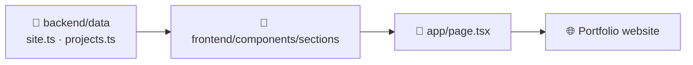

<div align="center">


### 💻 Software Engineer · 🤖 AI FullStack Developer · 📍 Costa Rica

_I build AI-powered full stack applications: clean interfaces, robust backends, and intelligent agents that solve real problems._

[](https://github.com/JorgeVillaTech)
[](https://www.linkedin.com/in/jorge-villalobos-herrera-87b28a126/)
[](mailto:jorgevihe@gmail.com)


🟢 **Available for freelance projects and full-time opportunities**

</div>

---

## 📖 Table of Contents

- [📖 Table of Contents](#-table-of-contents)
- [✨ About This Portfolio](#-about-this-portfolio)
- [🚀 Featured Projects](#-featured-projects)
  - [⚡ EV Chargers Reservations](#-ev-chargers-reservations)
  - [🤖 AI Financial Risk Agent](#-ai-financial-risk-agent)
- [🧠 Skills](#-skills)
- [�️ Tech Stack of This Website](#️-tech-stack-of-this-website)
- [📁 Project Structure](#-project-structure)
- [⚡ Getting Started](#-getting-started)
  - [✅ Requirements](#-requirements)
  - [🏁 Run it locally](#-run-it-locally)
  - [📜 Available scripts](#-available-scripts)
- [✏️ How to Customize](#️-how-to-customize)
- [📬 Contact](#-contact)

---

## ✨ About This Portfolio

This repository holds my **personal portfolio website**. It's a modern, fast, and fully responsive single-page site that shows who I am, what I build, and how to reach me.

The page is divided into simple sections:

| Section | What you'll find |
| --- | --- |
| 🏠 **Hero** | A quick intro: my name, role, and what I do |
| 🚀 **Projects** | The main projects I'm working on, with tech used and links |
| 📊 **Experience** | Key numbers and the philosophy behind my work |
| 📬 **Contact** | Easy ways to get in touch with me |

> 💬 _"Good software doesn't just work: it's understood, it scales, and it's maintained over time."_

---

## 🚀 Featured Projects

These are the two projects I've been developing recently:

### ⚡ EV Chargers Reservations


A web app to **manage and book electric vehicle chargers**. Users can see which chargers are free in real time and reserve one, while admins get a dashboard to control everything.

**Highlights:**
- 🔋 Create, view, edit, and delete chargers and reservations (full CRUD)
- ⏱️ Real-time availability tracking
- 🛡️ Admin dashboard for managing the system

**Built with:**


### 🤖 AI Financial Risk Agent


An **AI assistant that helps with financial risk management**. It analyzes financial data, gives recommendations, and lets you chat with it in plain language thanks to a Large Language Model (LLM).

**Highlights:**
- 📈 Analyzes financial data to spot risks
- 💡 Generates clear, actionable recommendations
- 💬 Conversational chat experience powered by an LLM

**Built with:**


---

## 🧠 Skills

<table>
<tr>
<th>💬 Languages</th>
<th>🧩 Frameworks & Libraries</th>
<th>☁️ AI & Cloud</th>
</tr>
<tr valign="top">
<td>

- JavaScript / TypeScript
- Python
- Java
- SQL

</td>
<td>

- React
- Next.js
- FastAPI
- CopilotKit + AG-UI

</td>
<td>

- LLMs & AI Systems (OpenAI)
- Microsoft Agent Framework
- AWS (Cloud Fundamentals)
- MySQL & SQLite

</td>
</tr>
</table>

---

## 🛠️ Tech Stack of This Website

| Tool | Why it's used |
| --- | --- |
| ⚛️ **Next.js 16** (App Router) | The framework that powers the site |
| 🔷 **React 19** | Builds the user interface |
| 🟦 **TypeScript** | Adds types for safer, cleaner code |
| 🎨 **Tailwind CSS 4** | Fast and consistent styling |
| 🧱 **shadcn/ui + Base UI** | Accessible, ready-to-use UI components |
| ✨ **Lucide Icons** | Clean and lightweight icons |
| 🔤 **Geist font** | Modern typography, optimized by `next/font` |
| 🌙 **Dark mode** | Enabled by default for a sleek look |

---

## 📁 Project Structure

The code is split into a simple **data layer** (`backend`) and a **UI layer** (`frontend`), so content can be changed without touching the design.

```text
src/
├── app/                      # 🧭 Next.js routes, layout, and global styles
│   ├── layout.tsx
│   ├── page.tsx
│   └── globals.css
├── backend/
│   └── data/                 # 🗂️ All the site content lives here
│       ├── site.ts           #    Profile, skills, stats, social links
│       └── projects.ts       #    Portfolio projects
└── frontend/
    ├── components/
    │   ├── layout/           # 🧱 Header and footer
    │   ├── sections/         # 📄 Hero, Projects, Experience, Contact
    │   └── ui/               # 🎛️ Reusable shadcn/ui components
    └── lib/                  # 🔧 Helper functions
```



---

## ⚡ Getting Started

### ✅ Requirements

- [Node.js](https://nodejs.org/) 20 or newer
- npm (comes with Node.js)

### 🏁 Run it locally

```bash
# 1. Clone the repository
git clone https://github.com/JorgeVillaTech/portfolio-dev.git
cd portfolio-dev

# 2. Install dependencies
npm install

# 3. Start the development server
npm run dev
```

Then open 👉 [http://localhost:3000](http://localhost:3000) in your browser.

### 📜 Available scripts

| Command | What it does |
| --- | --- |
| `npm run dev` | 🔥 Starts the dev server with hot reload |
| `npm run build` | 📦 Builds the site for production |
| `npm run start` | 🚀 Runs the production build |
| `npm run lint` | 🧹 Checks the code with ESLint |

---

## ✏️ How to Customize

All the content is stored in plain TypeScript files, so updating the portfolio is easy:

- 👤 **Profile, skills, and stats** → [src/backend/data/site.ts](src/backend/data/site.ts)
- 🚀 **Projects** → [src/backend/data/projects.ts](src/backend/data/projects.ts)

Just edit the values, save, and the page updates automatically. 🎉

---

## 📬 Contact

I'm always open to new projects, collaborations, and opportunities. Let's talk! 🤝

- 📧 **Email:** [jorgevihe@gmail.com](mailto:jorgevihe@gmail.com)
- 💼 **LinkedIn:** [Jorge Villalobos Herrera](https://www.linkedin.com/in/jorge-villalobos-herrera-87b28a126/)
- 🐙 **GitHub:** [@JorgeVillaTech](https://github.com/JorgeVillaTech)

---

<div align="center">

Made with ❤️ in Costa Rica 🇨🇷 by **Jorge Villalobos**

⭐ If you like this project, consider giving it a star!

</div>
